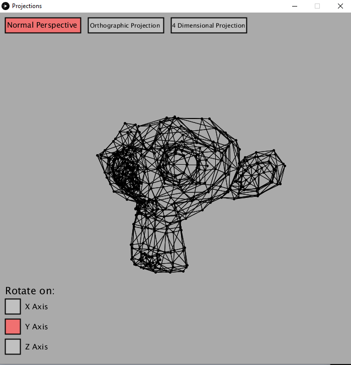

# Projecting 3D and 4D Points on a 2D Plane

In this project, linear algebra is used to essentially calculate how 3 or 4 dimensional objects would cast a shadow on a 2 dimensional plane. Reading in a series of vertices and edges from a .obj file, matrix multiplication is then used to project the vertices/edges onto the screen. This is all written using Processing.

## Normal Perspective

## Orthographic Projection

## 4 Dimensional Projection
For this projection, the vertices if a tesseract is calculated and used. 

